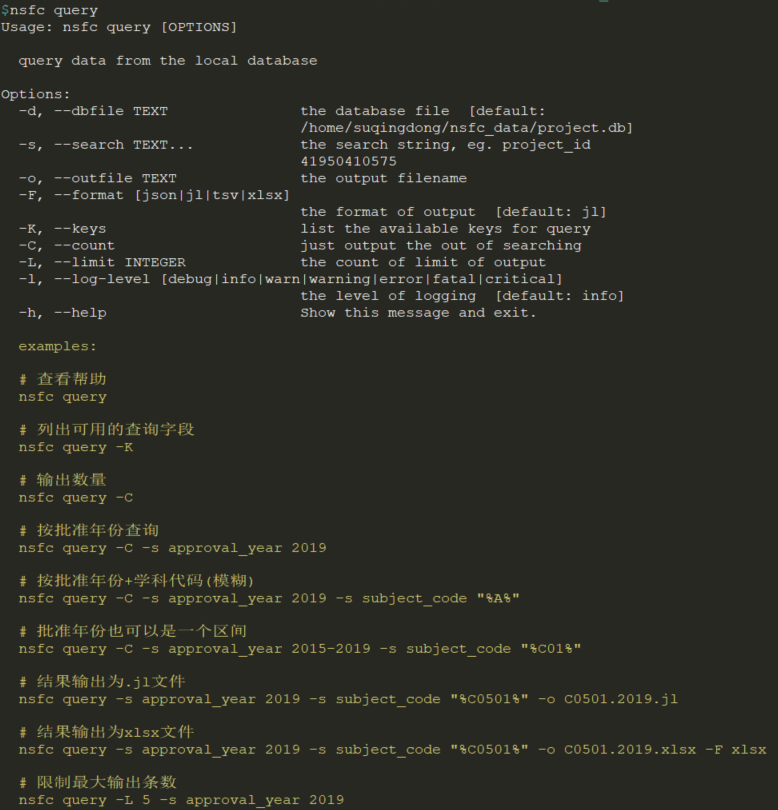
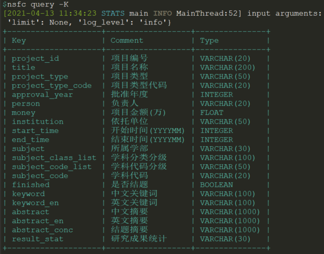
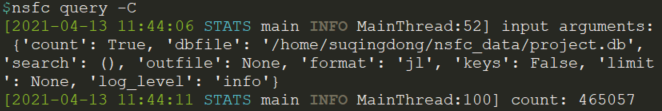
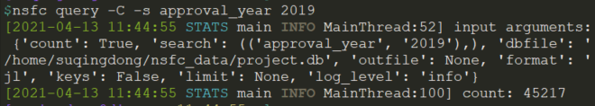
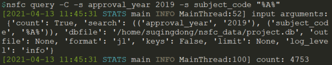
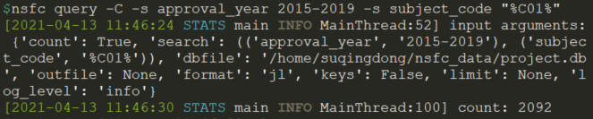
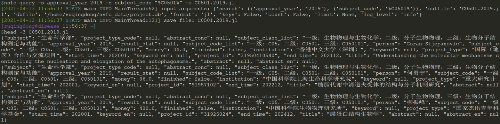
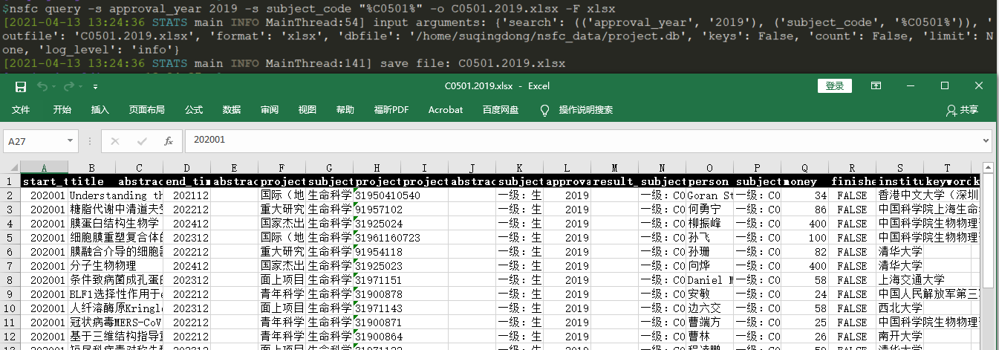

# 国家自然科学基金数据查询系统

## 安装
```bash
pip3 install nsfc
```

## 数据下载
> 数据库文件较大，可通过百度网盘进行下载
> ([下载链接](https://pan.baidu.com/s/1eadrfUg1ovBF1EAXWSTV-w) 提取码: `2nw5`)
- 下载所需的数据库文件，如project.A.sqlite3, 或全部数据project.all.sqlite3
- 保存至`nsfc`的安装路径下的`data`目录下, 如：`/path/to/site-packages/nsfc/data/project.db`
- 或者保存至`HOME`路径下的`nsfc_data`目录下，如`~/nsfc_data/project.db`

## 使用示例
```bash
# 查看帮助
nsfc query
```


```bash
# 列出可用的查询字段
nsfc query -K
```


```bash
# 输出数量
nsfc query -C
```


```bash
# 按批准年份查询
nsfc query -C -s approval_year 2019
```


```bash
# 按批准年份+学科代码(模糊)
nsfc query -C -s approval_year 2019 -s subject_code "%A%"
```


```bash
# 批准年份也可以是一个区间
nsfc query -C -s approval_year 2015-2019 -s subject_code "%C01%"
```


```bash
# 结果输出为.jl文件
nsfc query -s approval_year 2019 -s subject_code "%C0501%" -o C0501.2019.jl
```


```bash
# 结果输出为xlsx文件
nsfc query -s approval_year 2019 -s subject_code "%C0501%" -o C0501.2019.xlsx -F xlsx
```


```bash
# 限制最大输出条数
nsfc query -L 5 -s approval_year 2019                                           
```
